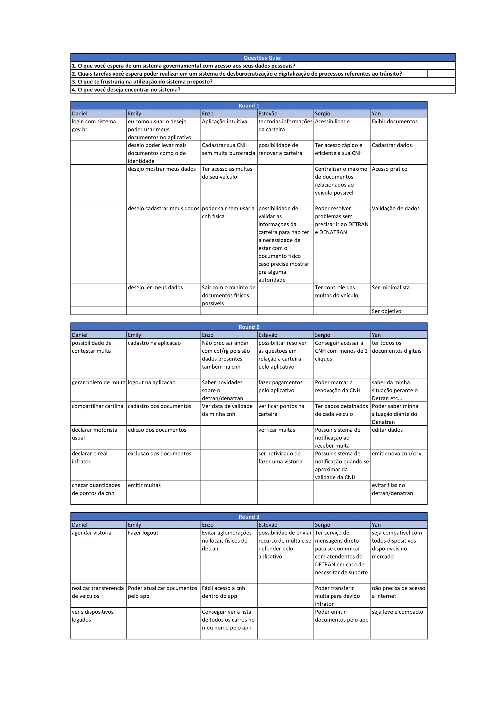

# Brainstorming

## 1. Introdução
&emsp;&emsp;Podendo ser conduzida em aproximadamente uma hora, uma sessão de brainstorming visa, de forma livre, o levantamento de um conjunto amplo e abrangente de opiniões dos participantes em torno de um tema.

&emsp;&emsp;Por se tratar de uma técnica muito dinâmica e, também, por permitir uma ampla discussão sobre os aspectos do sistema por todos os integrantes, a equipe optou em aplicar o brainstorming tendo como participantes os próprios integrantes da equipe e levando sempre em consideração as [Personas](personas.md) elaboradas bem como as seguintes perguntas guias:
 
- O que você espera de um sistema governamental com acesso aos seus dados pessoais?
- Quais tarefas você espera poder realizar em um sistema de desburocratização e digitalização de processos referentes ao trânsito?
- O que te frustraria na utilização do sistema proposto?
- O que você deseja encontrar no sistema?

## 2. Metodologia
&emsp;&emsp; A aplicação da técnica deu-se por meio de chamada on-line na plataforma Teams na data 02/03/2021. Foi disponibilizada uma planilha editável do [Excel](https://unbbr-my.sharepoint.com/:x:/r/personal/180149687_aluno_unb_br/Documents/Brainstorming%20requisitos.xlsx?d=w6173de047437450a8401ee0b2dfaf37c&csf=1&web=1&e=Ip219r) na qual os participantes realizaram três rounds de um minuto e meio. Em cada round, cada participante adicionou em seus espaços da planilha as ideias e opiniões que julgassem cabíveis. Ao final dos rounds, todos os participantes escolheram, dentre todas as informações registradas por todos, as suas preferidas. Feito isso, houve uma discussão acerca dos requisitos escolhidos por todos onde cada participante teve a oportunidade de defender e justificar suas escolhas e questionar as escolhas dos demais.

## 3. Requisitos Elicitados

### 3.1 Requisitos Funcionais

| Número | Requisito |
|:-:|--|
| 1 | Ter login integrado com o sistema GOV.br | 
| 2 | Ter acesso às multas do seu veículo |
| 3 | Ter acesso a versão digital da CNH |
| 4 | Ter acesso a versão digital do CRLV |
| 5 | Ter todas as informações dos documentos |
| 6 | Poder marcar a renovação da CNH |
| 7 | Checar quantidades de pontos da CNH | 
| 8 | Cadastro na aplicação |
| 9 | Fazer logout na aplicação |
| 10 | Gerenciar documentos |
| 11 | Excluir documentos |
| 12 | Se informar sobre o detran/denatran |
| 13 | Ter dados detalhados de cada veículo |
| 14 | Ter sistema de notificação ao receber multa |
| 15 | Ter detalhes sobre a situação perante ao departamento de trânsito |
| 16 | Ver quais dispositivos estão logados |
| 17 | Gerar boleto bancário para pagamento de multas |
| 18 | Recorrer a multas |
| 19 | Validar documentos |
| 20 | Declarar o real infrator |
| 21 | Ter sistema de notificação quando se aproximar da validade da CNH | 
| 22 | Marcar vistorias |
| 23 | Declarar motorista usual |
| 24 | Ter serviço de mensagens diretas para se comunicar com atendentes do DETRAN em caso de necessitar de suporte |

### 3.2 Requisitos Não Funcionais

| Número | Requisito |
|:-:|--|
| 1 | Ter acessibilidade |
| 2 | Ter acesso rápido e eficiente aos documentos |
| 3 | Desburocratizar demandas relativas a DETRAN e DENATRAN |
| 4 | Ser compatível com todos dispositivos disponíveis no mercado |
| 5 | Centralizar o máximo de documentos relacionados ao veículo possível |
| 6 | Ser prático e intuitivo |
| 7 | Ser minimalista |
| 8 | Ser objetivo |
| 9 | Possuir recursos off-line |

## 4. Tabela Brainstorm

## 5. Bibliografia

> BARBOSA. Simone. SILVA. Bruno. 2010. Interação Humano-computador.

## 6. Versionamento

| Versão | Data | Modificação | Autor |
|--|--|--|--|
| 0.1 | 02/03/2021 | Realização da sessão de brainstorming | Daniel Porto, Emily Dias, Enzo Gabriel, Estevão Reis, Sergio Cipriano e Yan Andrade |
| 1.0 | 08/03/2021 | Criação do documento e adição da Introdução, Aplicação e Bibliografia | Daniel Porto |
| 1.1 | 08/03/2021 | Adição dos requisitos elicitados | Daniel Porto |
| 2.0 | 01/05/2021 | Adicionando tabela utilizada para levantar os requisitos do brainstorm | Sergio Cipriano |
|  2.1   | 02/05/2021 | Ajuste de documento | Emily Dias |
