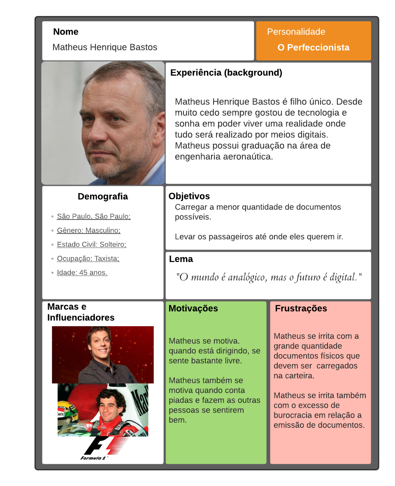
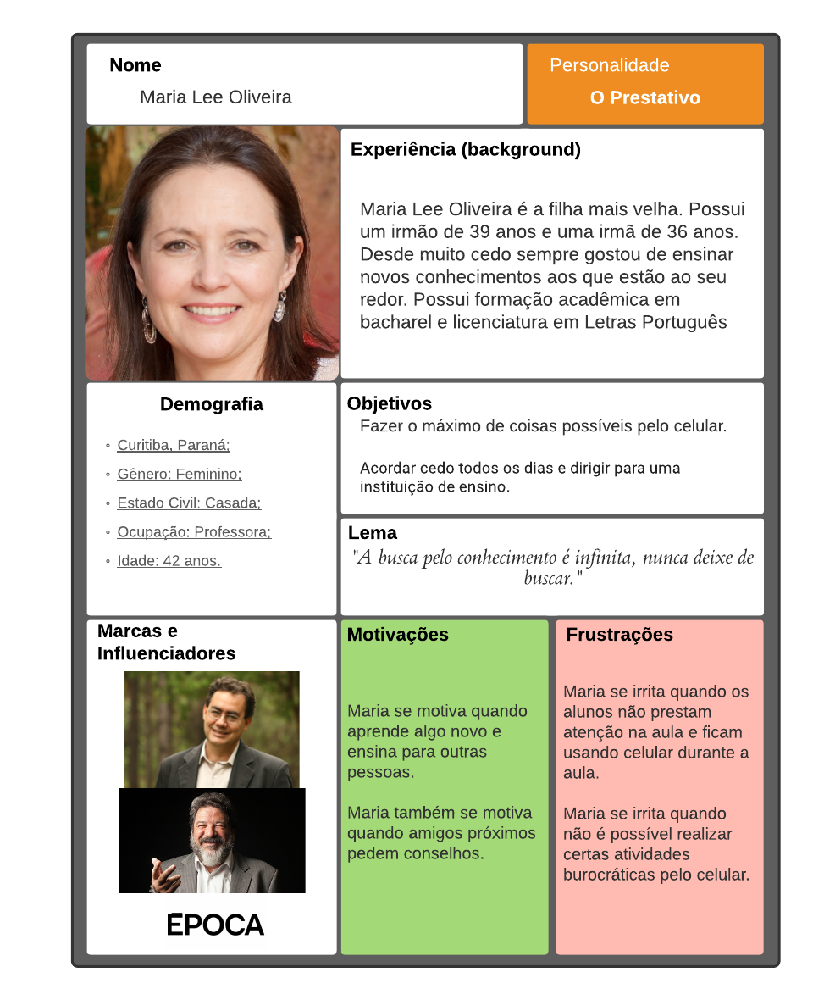

# Personas

## 1. Descrição

&emsp;&emsp; Uma persona é um personagem fictício, arquétipo hipotético de um grupo de usuários reais, criada para descrever um usuário típico (Cooper et al., 2007; Pruitt e Adlin,2006; Cooper, 1999). É muito usada para representar um tipo de pessoa que são os possíveis usuários. As personas são definidas por várias características, mas a principal delas é seus objetivos. Essas personas são determinadas através de discussões dos designers e refinando as possibilidades se é capaz de chegar em uma população aceitável.

&emsp;&emsp; Antes de prosseguirmos para as personas, vale ressaltar que todas as fotos foram retiradas do site <a href="https://thispersondoesnotexist.com/">ThisPersonDoesNotExist</a>. Esse site utiliza uma inteligência artificial para gerar imagens de pessoas fictícias, sendo assim, todas as imagens utilizadas não infringem nenhuma lei de direitos autorais.

&emsp;&emsp;Após a identificação desses grupos e de suas características predominantes, foi utilizado o site [uxpressia](https://uxpressia.com/) para inspiração ao criar os cartões de cada persona. 

&emsp;&emsp;Os tipos de personalidade foram baseados no site [vittude](https://www.vittude.com/blog/eneagrama/) utilizando a técnica de eneagrama.

## 2. Motivação

&emsp;&emsp; "É utilizada principalmente para representar um grupo de usuários finais durante discussões de design, mantendo todos focados no mesmo alvo. As personas são definidas principalmente por seus objetivos, que são determinados num processo de refinamentos sucessivos durante a investigação inicial do domínio de atividade do usuário. Em geral, começamos com uma aproximação razoável e convergimos numa população plausível de personas"(Barbosa e Silva, 2019, p. 176). 

## 3. Escolhas

&emsp;&emsp; A decisão da quantidade de personas veio da seguinte afirmação: "Courage e Baxter (2005) apontam um cuidado na escolha do número de personas elaboradas. É importante que as personas sejam memoráveis e, para isso, o elenco de personas deve ser reduzido. Se houver muitas personas para representar os grupos de usuários, elas vão se misturar na mente dos designers e desenvolvedores, e com isso reduzimos os benefícios dessa técnica. No entanto, o elenco deve cobrir os principais grupos de usuários, para ajudar a desenvolver um produto que funciona para todos. Ao nos limitarmos a uma única persona, podemos deixar de fora dados valiosos de usuários fi nais que não correspondam a um mesmo grupo. Uma recomendação comum é que o elenco de personas inclua três personas primárias."(Barbosa e Silva, 2019, p. 180). 

## 4. Personas do CDT

### 4.1 Personas Primárias

#### Matheus Henrique Bastos

Figura 1: Persona primária 1: Matheus Henrique Bastos. [Link para a imagem expandida](https://user-images.githubusercontent.com/48693812/116734598-d6a84180-a9c3-11eb-8834-fea60ace02e5.png)

#### Maria Lee Oliveira

Figura 2: Persona primária 2: Maria Lee Oliveira. [Link para a imagem expandida](https://user-images.githubusercontent.com/48693812/116734684-f3447980-a9c3-11eb-8631-b12e83466027.png)

### 4.2 Persona Secundária

#### Juliana Figo Sabugueiro

Figura 3: Persona secundária: Juliana Figo Sabugueiro. [Link para a imagem expandida](https://user-images.githubusercontent.com/48693812/116734811-12430b80-a9c4-11eb-9ea1-fd77ac7d191f.png)

### 4.3 Antipersona

#### Miguel Silva

Figura 4: Antipersona: Miguel Silva. [Link para a imagem expandida](https://user-images.githubusercontent.com/48693812/116735009-5504e380-a9c4-11eb-8b44-69d0c18f8eda.png)

## 5. Referência Bibliográfica

> BARBOSA, Simone; DINIZ, Bruno. Interação Humano-Computador, Editora Elsevier, Rio de Janeiro, 2010. 

## 6. Bibliografia

> - Cooper, A.; Reimann, R.; Cronin, D. About Face 3: The Essentials of Interaction Design. New York, NY: John Wiley & Sons, 2007.
  - Courage, C. & Baxter, K. Understanding your users: a practical guide to user requirements, methods, tools, and techniques. San Francisco, CA: Morgan Kaufmann Publishers, 2005.
  - Pruitt, J. & Adlin, T. Th e Persona Lifecycle: keeping people in mind throughout product design. San Francisco, CA: Morgan Kaufmann Publishers, 2006. 

## 7. Versionamento

|Data|Versão|Descrição|Autor|
|:-:|:-:|:-:|:-:|
|01/03/2021|1.0|Criação das personas e do documento|Sérgio Cipriano|
|11/03/2021|1.1|Correção de tarefas da Juliana Figo Sabugueiro|Sérgio Cipriano|
|11/03/2021|1.2|Correções de formatação da bibliografia e das referências|Sérgio Cipriano|
|30/04/2021|2.0|Criação dos cartões das personas|Yan Andrade|
