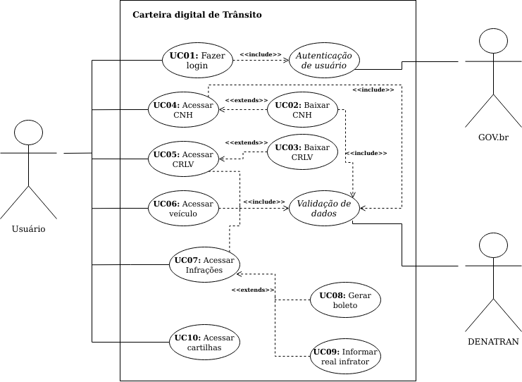

# Casos de Uso

## 1. Introdução

&emsp;&emsp;Um documento de caso de uso é uma técnica que descreve como o usuário realizará uma determinada tarefa dentro do contexto de um software. Ele descreve o ponto de vista do usuário e como o sistema responde a partir de suas ações, cada caso de uso é uma sequência de passos que são descritos a partir de fluxos, que começam com um objetivo principal e terminam quando esse objetivo está realizado.

&emsp;&emsp;Os casos de uso são a próxima etapa no processo de design, depois de ter a lista completa dos requisitos. Os casos de uso integram os requisitos em um pacote abrangente que descreve a interação do usuário com o sistema. Eles começam onde o processo de coleta de requisitos termina. Os requisitos determinam quais Casos de Uso o sistema terá, e muitos dos requisitos se tornarão sua lógica de negócios.

## 2. Metodologia
&emsp;&emsp; Para definir e criar os diagramas de caso de uso, fizemos uso dos principais cenários da aplicação, já existentes no projeto. Além disso, para conseguirmos descrever com detalhes os fluxos principais alternativos e de exceção dos casos de uso, executamos experimentalmente esses fluxos dentro da aplicação e tomamos nota de cada passo dentro do fluxo referente ao caso de uso

## 3. Diagrama de Casos de Uso

&emsp;&emsp;O diagrama foi desenvolvido utilizando a ferramenta Draw.io e pode ser acessado por [aqui](https://drive.google.com/file/d/15_uVgzoFekdPmloVPmu8C9aZdvbFF_wT/view?usp=sharing).

Figura 1: Diagrama de Casos de Uso Carteira Digital de Trânsito. [Link para a imagem expandida](https://user-images.githubusercontent.com/48573556/116772868-346e7500-aa28-11eb-9b87-70063fb61c8d.png)

## 4. Especificação dos Casos de Uso
### UC01 - Fazer o login
|UC01|Descrição|
|:-:|--|
|Descrição|Logar no sistema.|
|Ator|Usuário|
|Pré-condições|Acesso à internet e cadastro no sistema GOV.br|
|Ação|Entrar no app e ser capaz de acessar todas as opções dele|
|Fluxo Principal| **FP01** Fluxo de quando o ator faz o login no app 1. o ator clica em **"Entrar com gov.br"** 2. O sistema exibe a página de login do gov.br 3. O ator insere seus dados cadastrais para acessar a conta do gov.br 4. O ator é redirecionado para o menu principal do app.|
|Fluxo Alternativo| **FA01** Fluxo de quando o usuário deseja fazer o login quando ainda não é cadastrado 1. o ator clica em **"Entrar com gov.br"** 2. O sistema exibe a página de login do gov.br 3. O ator clica no botão "Criar sua conta" 4. O ator insere seus dados para criação da conta do gov.br 5. O ator é redirecionado para o menu principal do app.|
|Fluxo de Exceção| **FE01** Fluxo de quando o usuário não completa os campos para logar no sistema 1. o ator clica em **"Entrar com gov.br"** 2. O sistema exibe a página de login do gov.br 3. O ator preenche o campo "Número do CPF" 4. O ator não preenche o campo "Senha" 5. O sistema exibe uma mensagem de erro alertando sobre a necessidade de preencher tal campo |
|Pós-condições|O ator terá logado no sistema|
|  Rastreabilidade  |RF1, RF8|

### UC02 - Baixar CNH
|UC02| Descrição|
|:-:|--|
|Descrição|O usuário cadastra a CNH.|
|Ator|Usuário|
|Pré-condições| Acesso à internet , estar logado no app|
|Ação| O usuário cadastra o documento CNH no aplicativo|
|Fluxo Principal| **FP01** Fluxo de quando o ator deseja baixar a CNH no app 1. O ator clica na opção "Habilitação" 2. O app exibe a tela de opções para a habilitação 3. O ator clica na opção “Toque aqui para adicionar a sua CNH” 4. O sistema exibe a tela de opções de validação da CNH 5. O ator escolhe a opção “Validação pelo celular" 6. O sistema exibe a tela com instruções para fazer a validação pelo celular 7. O ator clica no botão "Vamos Começar" 8. O app exibe a tela para escanear o QR Code contido dentro da CNH 9. O ator escaneia o QR Code 10. O sistema exibe a tela com instruções para validação por biometria facial 11. O ator clica no botão "Avançar"  12. O app exibe a tela para validação por biometria facial com instruções para executar com sucesso  13. O usuário segue as recomendações e faz a validação  14. O app exibe a tela para informar o CEP do endereço informado de quando a CNH foi emitida 15. o ator preenche o campo "CEP" e clica no botão "Validar" 16. O sistema exibe a tela para fornecer o número do telefone do usuário para concluir a validação 17. O ator preenche o campo "Telefone com DD" e clica no botão "Concluir" 18. O sistema exibe a tela para criar uma chave para acessar todos os documentos cadastrados 19. O ator preenche os campos para cadastrar a chave e clica no botão "Cadastrar" 20. O sistema exibe um pop up perguntando se deseja utilizar o leitor biométrico do aparelho para acessar os documentos 21. O ator clica no botão "Sim" 22. O sistema exibe a parte frontal, traseira e interna da CNH |
|Fluxo Alternativo| **FA01** Fluxo de quando o ator possui o Certificado Digital e deseja baixar a CNH com ele 1. O ator clica na opção "Habilitação" 2. O app exibe a tela de opções para a habilitação 3. O ator clica na opção “Toque aqui para adicionar a sua CNH” 4. O sistema exibe a tela de opções de validação da CNH 5. O ator escolhe a opção “com certificado Digital" 6. O sistema exibe a tela para preencher o campo do código de validação enviado pelo Portal de Serviços do DENATRAN 7. O ator preenche o campo com o código de validação  8. O sistema exibe a tela para criar uma chave para acessar todos os documentos cadastrados 9. O ator preenche os campos para cadastrar a chave e clica no botão "Cadastrar" 10. O sistema exibe um pop up perguntando se deseja utilizar o leitor biométrico do aparelho para acessar os documentos 11. O ator clica no botão "Sim" 12. O sistema exibe a parte frontal, traseira e interna da CNH|
|Fluxo de Exceção| **FE01** Fluxo de quando o ator não tem a CNH em mãos 1. O ator clica na opção "Habilitação" 2. O app exibe a tela de opções para a habilitação 3. O ator clica na opção “Toque aqui para adicionar a sua CNH” 4. O sistema exibe a tela de opções de validação da CNH 5. O ator escolhe a opção “Validação pelo celular" 6. O sistema exibe a tela com instruções para fazer a validação pelo celular 7. O ator clica no botão "Vamos Começar" 8. O app exibe a tela para escanear o QR Code contido dentro da CNH 9. O ator não consegue prosseguir pois não tem o QR Code da CNH para escanear|
|Pós-condições| O ator poderá acessar sua CNH dentro do app sempre que desejar|
|Rastreabilidade| RF3, RF10, RF19|

### UC03 - Baixar CRLV
|UC03| Descrição|
|:-:|--|
|Descrição|Baixar o documento de CRLV para deixa-lo disponível no app.|
|Ator|Usuário|
|Pré-condições|Estar logado no CDT|
|Fluxo Principal|**FP01** Fluxo de quando o usuário deseja baixar os CRLV de veículos  1. Usuário seleciona a opção "Veículos"  2. Usuário seleciona a opção "Toque para adicionar um CRLV"  3. Usuário informa o número do RENAVAM 4. Usuário informa o númeor de segurnaça do CRV 5. Usuário seleciona a opção "Adicionar" 6. Usuário cadastra uma chave de acesso 7. Usuário seleciona sim o não para biometria em dispositivos compatíveis|
|Fluxo Alternativo| --|
|Fluxo de Exceção| **FE01** Fluxo de quando o usuário não tem os número do RENAVAM ou CRV  1. Usuário seleciona a opção "Veículos";  2. Usuário seleciona a opção "Toque para adicionar um CRLV"  3. O Usuário não consegue prosseguir pois não tem o Número do RENAVAM ou CRV|
|Pós-condições|O usuário poderá acessar seus CRLV dentro do app sempre que desejar |
|Rastreabilidade|RF4, RF5, RF10, RF13, RF15|

### UC04 - Acessar CNH
|UC04| Descrição|
|:-:|--|
|Descrição|O usuário acessar a CNH.|
|Ator|Usuário|
|Pré-condições|Estar logado no CDT, ter habilitação cadastrada.|
|Fluxo Principal| **FP01** Fluxo de quando o usuário deseja visualizar a CNH 1. Usuário seleciona a opção "Habilitação" na tela inicial 2. O sistema exibe a parte frontal, traseira e interna da CNH|
|Fluxo Alternativo| **FA01** Fluxo de quando o usuário deseja visualizar a CHN e não fez o cadastro da chave de acesso 1. Usuário seleciona a opção "Habilitação" na tela inicial 2. O sistema exibe a tela para criar uma chave para acessar todos os documentos cadastrados 3. O ator preenche os campos para cadastrar a chave e clica no botão "Cadastrar" 4. O sistema exibe um pop up perguntando se deseja utilizar o leitor biométrico do aparelho para acessar os documentos 5. O ator clica no botão "Sim" 7. O sistema exibe a parte frontal, traseira e interna da CNH|
|Fluxo de Exceção| **FE01** Sem acesso a internet 1. O usuário seleciona a opção "Habilitação" na tela inicial 2. O app mostra uma mensagem de falha de conexão|
|Pós-condições| O ator poderá visualizar sua CNH|
|Rastreabilidade| RF3, RF10, RF19|

### UC05 - Acessar CRLV
|UC05| Descrição|
|:-:|--|
|Descrição|O usuário acessar o CRLV.|
|Ator|Usuário|
|Pré-condições|Estar logado no CDT, ter CRLV baixado no app|
|Fluxo Principal| **FP01** Fluxo de quando o usuário deseja acessar o CRLV 1. Usuário seleciona a opção "Veículos" 2. Usuário digitar a chave de acesso ou insere a digital 3. Usuário seleciona o veículo que quer consultar o CRLV.|
|Fluxo Alternativo| --|
|Fluxo de Exceção| --|
|Pós-condições|O usuário poderá visualizar o CRLV do veículo escolhido|
|Rastreabilidade|RF4, RF5, RF13, RF15|

### UC06 - Acessar Veículo
|UC06| Descrição|
|:-:|--|
|Descrição|O usuário acessar todas as informações de um veículo.|
|Ator|Usuário|
|Pré-condições|Estar logado no CDT, ter CRLV baixado no app|
|Fluxo Principal| **FP01** Fluxo de quando o usuário deseja acessar todos as informaçẽos de um veículo 1. Usuário seleciona a opção "Veículos"  2. Usuário digitar a chave de acesso ou insere a digital 3. Usuário localiza o veículo 4. Usuário seleciona o veículo - O sistema disponibiliza quatro telas com as informações do veículo;|
|Fluxo Alternativo| **FA01** Fluxo de quando o usuário deseja acessar o RECALL de um veículo 1. Usuário seleciona a opção "Veículos"  2. Usuário digitar a chave de acesso ou insere a digital 3. Usuário localiza o veículo que possui Recall 3. Usuário seleciona o veículo 4. Usuário desliza a tela pra a esquerda quatro vezes 5. Usuário seleciona a opção "Sim, toque para detalhar"|
|Fluxo de Exceção| --|
|Pós-condições|O usuário poderá visualizar todas as informações do veículo escolhido|
|Rastreabilidade|RF4, RF5, RF10, RF13, RF15|

### UC07 - Acessar Infrações
|UC07| Descrição|
|:-:|--|
|Descrição|O usuário acessar suas infrações.|
|Ator|Usuário|
|Pré-condições|Estar logado no CDT|
|Fluxo Principal| **FP01** Fluxo de quando o usuário deseja acessar as infrações por infrator 1. Usuário seleciona a opção "Infrações"; 2. Usuário seleciona a opção "Por Infrator"|
|Fluxo Alternativo| **FA01** Fluxo de quando o usuário deseja acessar as infrações por veículos 1. Usuário seleciona a opção "Infrações"; 2. Usuário seleciona a opção "Por Veículo"|
|Fluxo de Exceção| --|
|Pós-condições|O usuário poderá visualizar as infrações|
|Rastreabilidade|RF2, RF7, RF15|

### UC08 - Gerar Boleto
|UC08| Descrição|
|:-:|--|
|Descrição|O usuário gerar boleto para pagamento de infrações.|
|Ator|Usuário|
|Pré-condições|Estar logado no CDT|
|Fluxo Principal| **FP01** Fluxo de quando o usuário deseja gerar boleto por infrator 1. Usuário seleciona a opção "Infrações" na tela inicial 2. Usuário seleciona a opção "Por Infrator" 3. Usuário seleciona a infração 4. Usuário seleciona a opção "Solicitar Boleto"|
|Fluxo Alternativo| **FA01** Fluxo de quando o usuário deseja gerar boleto por veículos 1. Usuário seleciona a opção "Infrações" na tela inicial 2. Usuário seleciona a opção "Por Veículo" 3. Usuário seleciona a infração 4. Usuário seleciona a opção "Solicitar Boleto"|
|Fluxo de Exceção| --|
|Pós-condições|Usuário poderá baixar um pdf do boleto de pagamento|
|Rastreabilidade|RF7, RF15, RF17|

### UC09 - Informar Real Infrator
|UC09| Descrição|
|:-:|--|
|Descrição|O usuário informar quem realmente cometeu uma infração.|
|Ator|Usuário|
|Pré-condições|Estar logado no CDT|
|Fluxo Principal| **FP01** Fluxo de quando o usuário deseja informar o real infrator 1. Usuário seleciona a opção "Infrações" 2. Usuário seleciona a opção "Por Veículo" 3. Usuário seleciona a infração 4. Usuário seleciona a opção "Informar real infrator"|
|Fluxo Alternativo| --|
|Fluxo de Exceção| --|
|Pós-condições|O usuário terá identificado quem realmente cometeu a infração com seu veículo.|
|Rastreabilidade|RF20|

### UC10 - Acessar Cartilhas
|UC10| Descrição|
|:-:|--|
|Descrição|O usuário acessar as cartilhas de campanhas educativas.|
|Ator|Usuário|
|Pré-condições|Estar logado no CDT|
|Fluxo Principal| **FP01** 1. Usuário seleciona a opção "Educação" na tela inicial.|
|Fluxo Alternativo| --|
|Fluxo de Exceção| --|
|Pós-condições|O usuário terá acesso a todas as cartilhas de capanhas educativas vigente no momento|
|Rastreabilidade|RF12, RF25|

## 5. Bibliografia

> - UML Use Case Diagrams. uml-diagrams. Disponívem em: <https://www.uml-diagrams.org/use-case-diagrams.html>. Acesso em: 30/04/2021.
> - WHITNEY, Ellen - Introduction to Gathering Requirements and Creating Use Cases. Disponível em: <https://www.codemag.com/article/0102061/Introduction-to-Gathering-Requirements-and-Creating-Use-Cases>. Acesso em: 18 Março 2021.
> - REINEHR, Sheila - Engenharia de Requisitos.

## 6. Versionamento

| Versão | Data       | Modificação                                         | Autor        |
| :-: | ---------- | --------------------------------------------------- | ------------ |
| 0.1    | 18/03/2021 | Criação dos tópicos do documento                    | Emily Dias   |
| 0.2    | 19/03/2021 | Adição de algumas UCs no documento                  | Emily Dias   |
| 0.3    | 20/03/2021 | Adição de um parágrafo na Introdução e bibliografia | Estevao Reis |
| 0.4    | 20/03/2021 | Adição de Fluxos                                    | Estevao Reis |
| 0.5    | 20/03/2021 | Adição do diagrama                                  | Emily Dias   |
| 0.6    | 22/03/2021 | Correção de erros ortográficos                      | Estevao Reis |
| 1.0    | 22/03/2021 | Adição da Metodologia                               | Estevao Reis |
|2.0|30/04/2021|Refatoração do documento|Daniel Porto|
|  1.1   | 02/05/2021 | Ajuste de documento | Emily Dias |