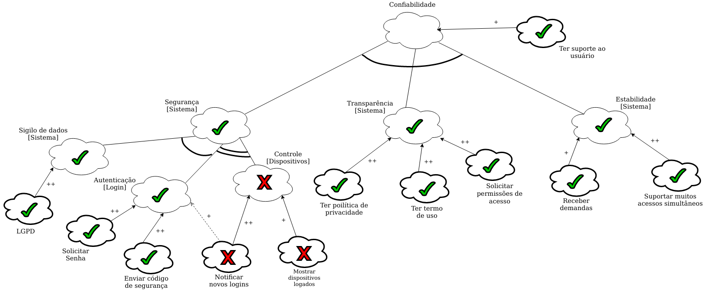

# NFR Framework

## Introdução

&emsp;&emsp;Inicialmente proposto em 1992 e desenvolvido por Dr. Lawrence Chung, em 1999. “O NFR Framework é uma abordagem orientada a processos, onde os requisitos não-funcionais são explicitamente representados como metas a serem obtidas” [CHUNG, 1995]. 
&emsp;&emsp;Estão relacionados com o comportamento dum sistema e não com as suas funcionalidades – “descrevem como o sistema faz e não o que faz” [CHUNG]. 
&emsp;&emsp;São, normalmente, representados por gráficos SIG (Softgoal Interdependency Graph), que descrevem as dependências entre os softgoals e como eles são decompostos;

## Metodologia

&emsp;&emsp;Podem ser abordados diversos tipos de softgoals no NFR framewok como: Usabilidade, Perrformance, Segurânça, etc. Sendo assim, a aplicação da técnica deu-se, primeiramente, pela análise dos [requisitos não funcionais](../../elicitacao/requisitos/#requisitos-nao-funcionais) elicitados anteriormente. Tal análise teve como objetivo a identificação dos tipos de softgoals que os requisitos tentam cobrir. 
&emsp;&emsp;Analisados os requistos, conclui-se que, no geral, os requisitos do projeto buscam englobar as seguintes softgoals:

- Usabilidae;
- Eficiência;
- Confiabilidade;
- Portabilidade;

&emsp;&emsp;Feitas as devidas análises e definas as softgoals, para o desenvolvimento dos gráficos foi elaborada um padrão de representação que está representado na legenda abaixo.

Figura 1: Legenda

 
&emsp;&emsp;Sendo assim, utilizando a ferramenta Draw.Io, foram desenvolvidos os gráficos SIG que segem.

## Usabilidade
### Sem propagação

Figura 2: SIG Usabilidade sem propagação [Link para a imagem expandida](https://user-images.githubusercontent.com/48573556/113076618-d4c14780-91a5-11eb-83a0-bc7cda32812f.png)

### Com propagação

Figura 3: SIG Usabilidade com propagação [Link para a imagem expandida](https://user-images.githubusercontent.com/48573556/113079410-58c9fe00-91ab-11eb-9c1b-6bbdccc31d23.png)

## Portabilidade

### Sem propagação

Figura 4: SIG Portabilidade com propagação [Link para a imagem expandida](https://user-images.githubusercontent.com/52640974/113037174-80997180-916b-11eb-981d-0d0e5c4eaabb.png)

### Com propagação

Figura 5: SIG Portabilidade com propagação [Link para a imagem expandida](https://user-images.githubusercontent.com/52640974/113144699-eb968700-9203-11eb-8ea6-29bcdfccd2ff.png)

## Confiabilidade
### Sem propagação

Figura 6: SIG Confiabilidade sem propagação [Link para a imagem expandida](https://user-images.githubusercontent.com/48573556/113079616-c544fd00-91ab-11eb-8941-614455ce6c25.png)

### Com propagação

Figura 7: SIG Confiabilidade com propagação [Link para a imagem expandida](https://user-images.githubusercontent.com/48573556/113079416-5b2c5800-91ab-11eb-9dff-ed3e59058b4c.png)

## Eficiência

### Sem propagação

Figura 8: SIG Eficiência com propagação [Link para a imagem expandida](https://user-images.githubusercontent.com/52640974/113145063-5d6ed080-9204-11eb-9d49-57ce22849b58.png)

### Com propagação

Figura 9: SIG Eficiência com propagação [Link para a imagem expandida](https://user-images.githubusercontent.com/52640974/113145257-9d35b800-9204-11eb-9e00-134905b99764.png)

## Bibliografia

> - Requisitos Não-Funcionais. UFPE. Disponível em: https://www.cin.ufpe.br/~if716/arquivos20152/experimentoBruno/Aula2/Aula2-Parte2-NFR%20Framework.pdf. Acesso em: 16 de out. de 2020.
> - BRITO, Isabel Sofia; JANEIRO, José; GOMES, Joaquim. "NFR Framework, Engenharia de Software (2007-2008)". Disponível em: <http://jaejaneiro.orgfree.com/engsofnfr.pdf>
> - SILVA, Reinaldo Antônio. "NFR4ES: Um Catálogo de Requisitos Não-Funcionais para Sistemas Embarcados (2019)".
## Versionamento

| Versão | Data       | Modificação          | Autor      |
| :----: | ---------- | -------------------- | ---------- |
|  0.1	 | 25/03/201  | Análise dos requisitos não funcionais e definição dos softgoals | Daniel e Emily |
|  1.0   | 25/03/2021 | Adição da introdução | Emily Dias |
|  1.1   | 27/03/2021 | Adição dos participantes | Emily Dias |
|  1.2   | 30/03/2021 | Adição dos ítens de portabilidade e eficiência | Emily Dias |
|  1.3   | 30/03/2021 | Padronização do documento e adição da metodologia e dos ítens de usabilidade e confiabilidade | Daniel Porto |
|  1.4   | 31/03/2021 | Padronização dos ítens de portabilidade e eficiência | Emily Dias |
