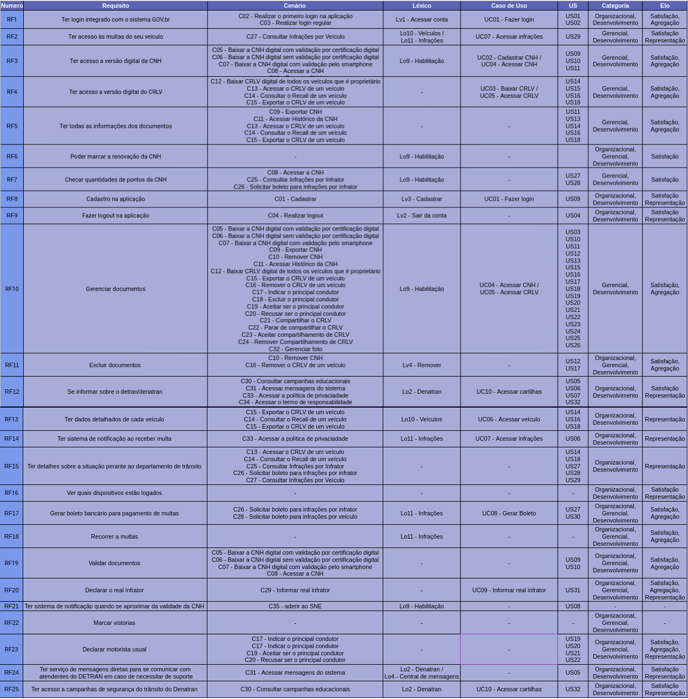

# Matriz Foward-From

## 1. Introdução
&emsp;&emsp;A pós-rastreabilidae está concentrada no ciclo de vida dos requisitos depois de sua especificação de requisitos. Permite identificar quais componentes do software implementam um determinado requisito. Também possibilita saber quais requisitos estão associados a um componente do software. A rastreabilidade **forward-from** liga requisitos a artefatos de desenho e implementação.

## 2. Metodologia
&emsp;&emsp;Para criar a matriz foward-from, foi utilizada, para especificar os elos de rastreabilidade, o meta-modelo de Toranzo que classifica as informações a serem rastreadas em quatro níveis:  

**Ambiental**: congrega informações oriundas do contexto ambiental onde a organização está inserida e que podem afetar o sistema sendo desenvolvido;  
**Organizacional**: reúne informações relacionadas à organização (missão, objetivos, metas e padrões) e que podem impactar os requisitos do sistema;  
**Gerencial**: grega informações que permitem associar tarefas a requisitos, e que podem auxiliar a gerência do projeto;  
**Desenvolvimento**: abarca informações relacionadas aos diversos artefatos gerados no processo de desenvolvimento. 

&emsp;&emsp;Neste meta-modelo, o suporte à rastreabilidade identifica os seguintes tipos de elos:  

**Satisfação**: indica que a classe de origem tem dependência de satisfação com classe de destino;  
**Recurso**: indica que a classe de origem tem dependência de recurso com classe de destino;  
**Responsabilidade**: registra a participação, responsabilidade e ação de pessoas sobre artefatos;  
**Representação**: captura a representação ou modelagem dos requisitos em outras linguagens;  
**Alocado**: classe de origem está relacionada à classe de destino, que representa um subsistema;  
**Agregação**: indica composição de elementos.  

## 3. Matrizes

### 3.1. Requisitos Funcionais

Voce pode visualizar o link da planilha [aqui](https://docs.google.com/spreadsheets/d/17coHM9K_uAhjtBnQHhdYcbnBRjqoUAP5yWD2YwwLo_M/edit?usp=sharing)

### 3.2. Requisitos Não Funcionais

Voce pode visualizar o link da planilha [aqui](https://docs.google.com/spreadsheets/d/1foIYmVKaXko0nOfEn0NQv87n2GSs2nqv65cDbOmsLR4/edit?usp=sharing)

## 4. Referência Bibliográfica

> - VAZQUEZ, Carlos Eduardo, SIMÕES, Guilherme Siqueira - Engenharia de Requisitos: Software Orientado ao Negócio. Acesso em: 01 de Maio de 2021
> - LEITE, Julio Cesar Sampaio do Prado, SAYÃO, Miriam - Monografias em Ciência da Computação n° 20/05- Rastreabilidade de Requisitos. Acesso em: 01 de Maio de 2021

## 5. Versionamento

| Versão | Data | Modificação | Autor |
| - | - | - | - |
| 0.1 | 01/05/2021 | Criação da tabela de requisitos funcionais | Estevão Reis, Sergio Cipriano |
| 1.0 | 01/05/2021 | Criação dos tópicos do documento e inserção da Introdução  e metodologia e referências | Estevão Reis |
| 1.1 | 01/05/2021 | Simplificando formatação do documento para priorizar a execução e não a estética | Sergio Cipriano |
| 1.2 | 02/05/2021 | Inserção da Imagem dos requisitos funcionais e refatoração na visualização do documento | Estevão Reis |
|  1.3   | 02/05/2021 | Ajuste de documento | Emily Dias |

