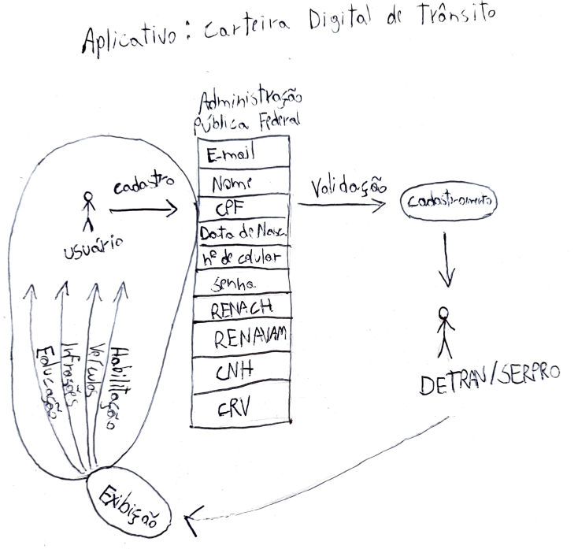
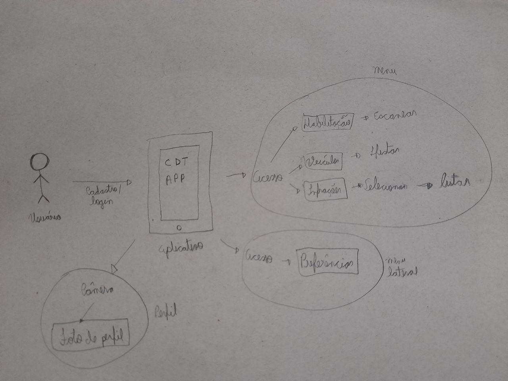
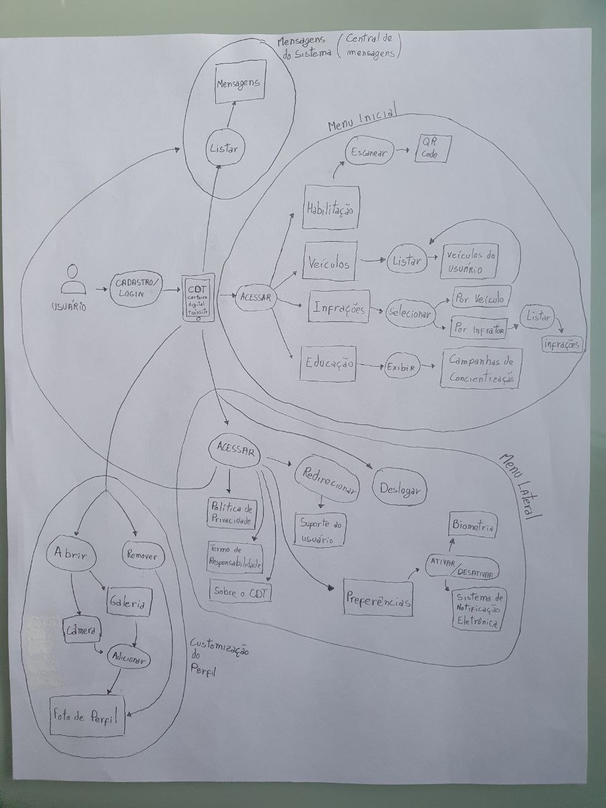
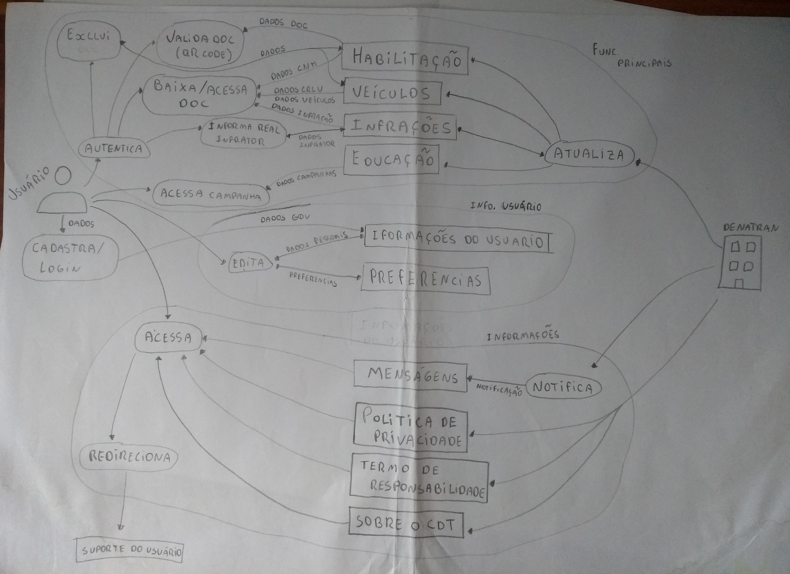

## Introdução

&emsp;&emsp; O Rich Picture é uma forma de representar o sistema e suas interações por meio de diagramas gráficos. É uma ferramenta que cabe muito bem em momentos iniciais ou de revisões do projeto fornecendo um modelo mental preliminar.

## Metodologia
&emsp;&emsp; A metodologia Soft Systems Methodology (SSM), que é de onde os rich pictures fazem parte foi proposta por Checkland (1999) apud Bernardo et al. (2008). Este método é utilizado para analisar problemas complexos de uma perspectiva de sistema, onde se observa os problemas e suas soluções correspondentes. 
&emsp;&emsp; Para o rich picture foi feito a divisão que cada membro faria um modelo desenhado dos diagramas em algum papel, com isto foi escolhido a rich picture com mais detalhes e mais correta, e por fim foi feito a evolução do sistema para obter a versão final do rich picture.

## Diagrama de Partida

&emsp;&emsp;Para a criação dos diagramas utilizamos a ferramenta LucidChart

Figura 1: Diagrama de Partida.

## Esboço da rich picture completa

Figura 2: Esboço da rich picture completa do CDT.

## Rich picture completa da aplicação

Figura 3: Rich picture completa da aplicação.

## Rich picture completa da aplicação (aprimorada)

Figura 4: Rich picture completa da aplicação (aprimorada).

## RP1 - Funcionalidades Principais

Figura 5: Funcionalidades principais.

[Link para a imagem expandida](https://user-images.githubusercontent.com/48573556/108143785-1e971800-70a7-11eb-9c19-3271177b1341.png)

## RP2 - Informações

Figura 6: Informações gerais.

[Link para a imagem expandida](https://user-images.githubusercontent.com/48573556/108143861-44242180-70a7-11eb-9931-1fbae7790712.png)

## RP3 - Informaçẽos do Usuário

Figura 7: Informações do usuário.

[Link para a imagem expandida](https://user-images.githubusercontent.com/48573556/108143910-5d2cd280-70a7-11eb-87c1-a9c9fa404ba7.png)

## Referências Bibliográficas

> - Rich Pictures. BetterEvaluation. Disponível em: https://www.betterevaluation.org/en/evaluation-options/richpictures, acesso em: 17 de fev. de 2021;
>  - The Rich Picture: A Tool forReasoning About Work Context. Andrew Monk and Steve Howard. Disponível em: https://www.ics.uci.edu/~wscacchi/Software-Process/Readings/RichPicture.pdf, acesso em: 17 de fev. de 2021.
> - 

## Versionamento
|Data|Versão|Descrição|Autor|
|----|------|---------|-----|
|14/02/2021|0.1|Criação do diagrama de partida|Daniel Porto|
|14/02/2021|0.2|Criação da rich picture completa da aplicação|Sérgio Cipriano|
|15/02/2021|0.3|Criação do esboço da rich picture completa|Emily Dias|
|16/02/2021|0.4|Criação da rich picture completa da aplicação (aprimorada)|Daniel Porto|
|17/02/2021|1.0|Criação do documento, adição da introdução e dos Rich Pictures|Daniel Porto|
|17/02/2021|1.1|Correções de erros de digitação|Daniel Porto|
|19/02/2021|1.2|Adicionando legenda nas imagens|Sérgio Cipriano|
|11/03/2021|2.0|Adicionando esboço de rich pictures|Sérgio Cipriano|
|23/04/2021|2.0|Adição da metodologia|Emily Dias|
